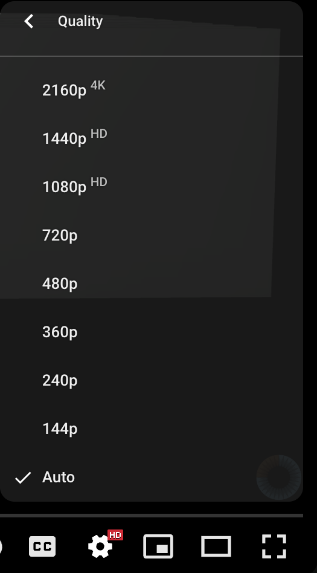
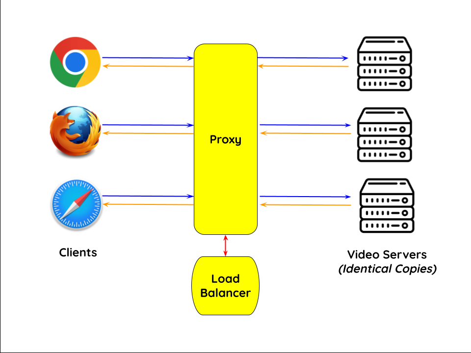

# Adaptive & Load-Balanced Video Streaming CDN

> I'm glad that I learnt about Computer Networks from [Prof. Hong Xu (Henry)](https://henryhxu.github.io/). Henry gives comprehensive yet easy-to-follow lectures, which are always complemented with simple & clear animations. Most importantly, he & his teaching team pose interesting assignments that are not toy problems & actually relate to the real world. This is (sadly) not something common in universities & the reason why this repo exists.

Video traffic dominates the Internet. In this project, we explore how video content distribution networks (CDNs) work. In particular, we implemented (1) adaptive bitrate selection through an HTTP proxy server and (2) load balancing. 

This project has the following goals:
 - Understand the HTTP protocol and how it is used in practice to fetch data from the web. 
 - Understand the DASH MPEG video protocol and how it enables adaptive bitrate video streaming. 
 - Use epoll() to implement a server capable of handling multiple simultaneous client connections. 
 - Understand how Video CDNs work in real life. 

## Background

### Video CDNs in the Real World


The figure above depicts a high level view of what this system looks like in the real world. Clients trying to stream a video first issue a DNS query to resolve the service's domain name to an IP address for one of the CDN's video servers. The CDN's authoritative DNS server selects the “best” content server for each particular client based on
(1) the client's IP address (from which it learns the client's geographic location) and
(2) current load on the content servers (which the servers periodically report to the DNS server).

Once the client has the IP address for one of the content servers, it begins requesting chunks of the video the user requested. The video is encoded at multiple bitrates. As the client player receives video data, it calculates the throughput of the transfer and it requests the highest bitrate the connection can support (i.e. play a video smoothly, without buffering if possible). For instance, you have almost certainly used a system like this when using the default "Auto" quality option on YouTube:




### Video CDN in this Project

Normally, the video player clients select the bitrate of the video segments they request based on the throughput of the connection. However, in this project, we are implementing this functionality on the server side. The server will estimate the throughput of the connection with each client and select a bitrate it deems appropriate.



We wrote the components highlighted in yellow in the diagram above (the proxy and the load balancer). 

**Clients:** Any off-the-shelf web browser (Firefox, Chrome, etc.) to play videos served by our CDN (via our proxy). You can simulate multiple clients by opening multiple tabs of the web browser and accessing the same video, or even using multiple browsers. You can use network throttling options in your browser to simulate different network conditions (available in both Firefox and Chrome).

**Video Server(s):** Video content will be served from our custom video server; instructions for running it are included below. With the included instructions, you can run multiple instances of video servers as well on different ports. 

**Proxy:** Rather than modify the video player itself, we implemented adaptive bitrate selection in an HTTP proxy. The player requests chunks with standard HTTP GET requests; our proxy will intercept these and modify them to retrieve whichever bitrate our algorithm deems appropriate, returning them back to the client. Our proxy will be capable of handling multiple clients simultaneously. 

**Load Balancer:** We implemented a simple load balancer that can assign clients to video servers either geographically or using a simple round-robin method. This load balancer is a stand-in for a DNS server; as we are not running a DNS protocol, we will refer to it as a load balancer. The load balancer will read in information about the various video servers from a file when it is created; it will not communicate with the video servers themselves. The proxy can query the load balancer every time a new client connects to figure out which video server to connect to. 

### Important: IPs and Ports
In the real world, IP Addresses disambiguate machines. Typically, a given service runs on a predetermined port on a machine. For instance, HTTP web servers typically use port 80, while HTTPS servers use port 443. 

For the purposes of this project, as we want to be able to run everything locally, we will instead distinguish different video servers by their (ip, port) tuple. For instance, you may have two video servers running on (localhost, 8000) and (localhost, 8001). We want to emphasize that this would not make much sense in the real world; you would probably use a DNS server for load balancing, which would point to several IPs where video servers are hosted, each using the same port for a specific service.

## Getting Started 
This project has been adapted so that it can be run and tested on your own device, without any need for a virtual machine. Although this leads to a slightly less realism, it makes development faster and easier. 

> Note: The only configuration that cannot be tested locally is running a geographic load balancer in conjunction with a load-balancing miProxy. This will have to occur on something like Mininet.

### Running the Video Server
> We have provided a simple video server (& CUHK's promotional video) for you!

For Python, we will be using the [uv package manager](https://github.com/astral-sh/uv). Please follow the instructions on the linked Github page to install uv on your machine. 

Once you have installed uv, you can navigate to the `videoserver/` directory and run 
```bash
uv sync
```
This will download all necessary Python dependencies and create a virtual environment. You can then run 
```bash
uv run launch_videoservers.py 
```
to launch videoservers. This takes the following command line arguments
* `-n | --num-servers`: Defaults to 1. Controls how many video servers will be launched. 
* `-p | --port`: Defaults to 8000. Controls which port the video server(s) will serve on. For multiple videoservers, the ports will be sequential; for instance, running the following command will launch three videoservers on ports 8000, 8001, and 8002. 
```bash
uv run launch_videoservers.py -n 3 -p 8000
```

Once you launch a videoserver (e.g. on port 8000), you can navigate to `127.0.0.1:8000` (or `localhost:8000`) in your browser to see it. It will look something like this:


You can click on the linked pages to play the videos.

Note that you are currently directly accessing the video server; when testing this project, you will instead navigate to the `ip:port` of the running proxy, which will communicate with the video server for you. 

### Libraries
`cxxopts` is used for parsing command-line options, `spdlog` is used for logging, and `pugixml`, a [C++ XML-parsing library](https://pugixml.org/) & the `boost::regex` are used to make parsing video manifest files and HTTP requests much easier. Documentation for these libraries is available online. 

We provide a script `download_deps.sh` to download these libraries, all the downloaded libraries will be stored under the `deps` folder. 

``` bash
./download_deps.sh
```

After downloading, the structure of `deps` folder should be:

```
.
├── cxxopts
├── pugixml
└── spdlog
```

You may have to install Boost on your system. If you are on a Mac, this is very easy. Simply use Homebrew and run

```bash
brew install cmake boost
```

On Windows or Linux, installing CMake and Boost are also relatively simple. On Ubuntu / WSL, you can run
```bash
sudo apt install cmake libboost-all-dev
```

## Adaptive HTTP Proxy

Many video players monitor how quickly they receive data from the server and use this throughput value to request better or lower quality encodings of the video, aiming to stream the highest quality encoding that the connection can handle. Instead of modifying an existing video client to perform bitrate adaptation, we implemented this functionality in an HTTP proxy through which your browser will direct requests.

### Running `adaptiveProxy`
To operate `adaptiveProxy`, it should be invoked in one of two ways:

#### Method 1: No load balancing with a single video server. 

```
./adaptiveProxy -l 9000 -h 127.0.0.1 -p 8000 -a 0.5 
```

* `-l | --listen-port`: The TCP port your proxy should listen on for accepting connections from your browser.
* `-h | --hostname`: Argument specifying the IP address of the video server from which the proxy should request video chunks. 
* `-p | --port`: Argument specifying the port of the video server at the IP address described by `hostname`. 
* `-a | --alpha`: A float in the range [0, 1]. Used as the coefficient in EWMA throughput estimate.

#### Method 2: Load balancing functionality

In this mode of operation your proxy should obtain a video server IP for each new client connection by sending a request to the load balancer. 

```
./adaptiveProxy -b -l 9000 -h 127.0.0.1 -p 8000 -a 0.5 
```
* `-b | --balance`: The presence of this flag indicates that load balancing should occur. 
* `-l | --listen-port`: The TCP port your proxy should listen on for accepting connections from your browser.
* `-h | --hostname`: Argument specifying the IP address of the **load balancer**. 
* `-p | --port`: Argument specifying the port of the load balancer at the IP address described by `hostname`. 
* `-a | --alpha`: A float in the range [0, 1]. Used as the coefficient in EWMA throughput estimate.

## Load Balancer

To spread the load of serving videos among a group of servers, most CDNs perform some kind of load balancing. A common technique is to configure the CDN's authoritative DNS server to resolve a single domain name to one out of a set of IP addresses belonging to replicated content servers. The DNS server can use various strategies to spread the load, e.g., round-robin, shortest geographic distance, or current server load (which requires servers to periodically report their statuses to the DNS server). 

We wrote a simple load balancing server, `loadBalancer`, that implements load balancing in two different ways: round-robin and geographic distance. As mentioned earlier, we will not implement a DNS server in order to run videoservers locally, as your load balancer will need to specify both an IP address and a port. 

### Protocol 
The protocol used by the load balancer is defined in `cpp/src/common/loadBalancer_protocol.h`. `adaptiveProxy` should send a `LoadBalancerRequest`, and the load balancer should respond with a `LoadBalancerResponse`. 

### Round-Robin Load Balancer
One of the ways you will run the load balancer is as a simple round-robin load balancer. It will take a file containing a list of videoserver IP addresses and ports on the command line. Beginning at the start of the list, the load balancer will return the next IP address in the list for each subsequent request, looping back to the top of the list when it reaches the end. 

An example of the input file format is in `sample_round_robin.txt`:
```
NUM_SERVERS: 3
127.0.0.1 8000  
127.0.0.1 8001
127.0.0.1 8002
```

### Geographic Distance Load Balancer
Another way to run the load balancer is to have it return the closest video server to the client based on the client IP address included in the request. In the real world, this would be done by querying a database mapping IP prefixes to geographic locations. For our implementation, however, information will be given in a text file about the entire state of the network, and the load balancer will return the closest geographic server to a client. 

> Note: You may question how useful it is to return a closest server when all requests are going through the proxy anyway. You are absolutely right! But you can easily imagine a scenario where the load balancer is actually a DNS server, and the bitrate adaptation behavior of the proxy occurs in the browser itself. 

The text file will be represented in the following way:
```
NUM_NODES: <number of hosts and switches in the network>
<host_id> <CLIENT|SWITCH|SERVER> <IP address|NO_IP>
[Repeats for a total of NUM_NODES rows, including the one above this]
NUM_LINKS: <number of links in the network>
<origin_id> <destination_id> <cost>
[Repeats for a total of NUM_LINKS rows, including the one above this]
```


As an example, the network shown above will have the following text file, `sample_geography.txt`:
```
NUM_NODES: 6
CLIENT 10.0.0.1
CLIENT 10.0.0.2
SWITCH NO_IP
SWITCH NO_IP
SERVER 10.0.0.3
SERVER 10.0.0.4
NUM_LINKS: 5
0 2 1
1 2 1
2 3 1
3 4 6
3 5 1
```

Note that geographic load balancing does not include port numbers. Videoservers are assumed to be running on port 8000 on the server IPs when responding as a geographic load balancer. 

#### Edge Cases
* If two servers are equidistant from a client, the earlier one in the file is returned. 
* If no server is found that has a path to the given client, or a CLIENT_IP is passed that is not actually a valid client in the network, the load balancer close the socket without responding. 

### Running `loadBalancer`

LoadBalancer should run with the following arguments:
```
loadBalancer [OPTION...]

-p, --port arg     Port of the load balancer
-g, --geo          Run in geo mode
-r, --rr           Run in round-robin mode
-s, --servers arg  Path to file containing server info
```

For instance, you could run 
```
./build/bin/loadBalancer --rr -p 9000 -s sample_round_robin.txt
```

## Acknowledgements

This is for CSCI4430: Computer Networks, Spring 2025 of CUHK (my favorite course taken in undergraduate studies), which is based on [Peter Steenkiste](https://www.cs.cmu.edu/~prs/)'s CMU CS 15-441: Computer Networks & [Mosharaf Chowdhury](http://www.mosharaf.com/)'s Umich EECS 489: Computer Networks.
